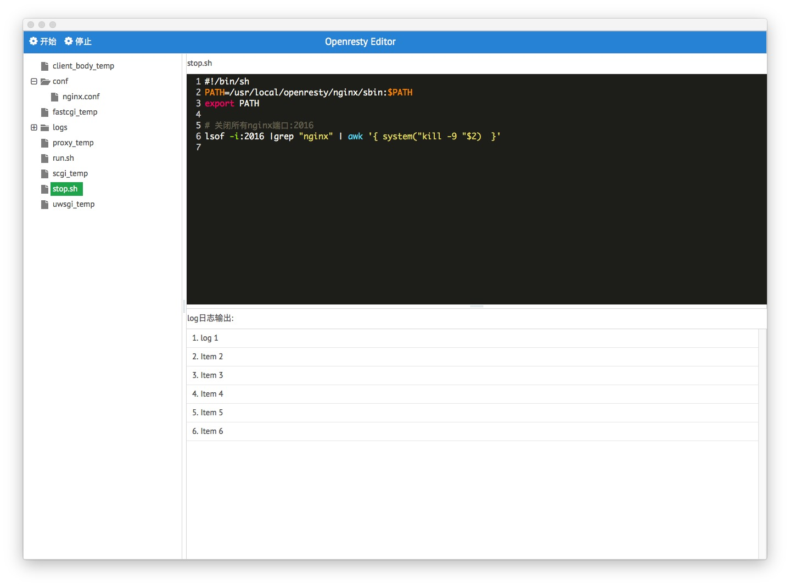

# Openresty Editor
------

Openresty给我们的后台开发带来了便利，同时也增加了一些业务上的烦琐，频繁的修改lua，conf配置，还要不停的重启后台程序，不断的切换窗口观察Log日志。现在把这些烦恼统统交给Openresty Editor，让你更好的专注在业务代码的书写与调试上。

> * 左侧动态文件列表功能
> * 常用文件语法着色支持
> * 关联文件列表与右侧文本编辑窗口
> * 其他功能正在开发完善

